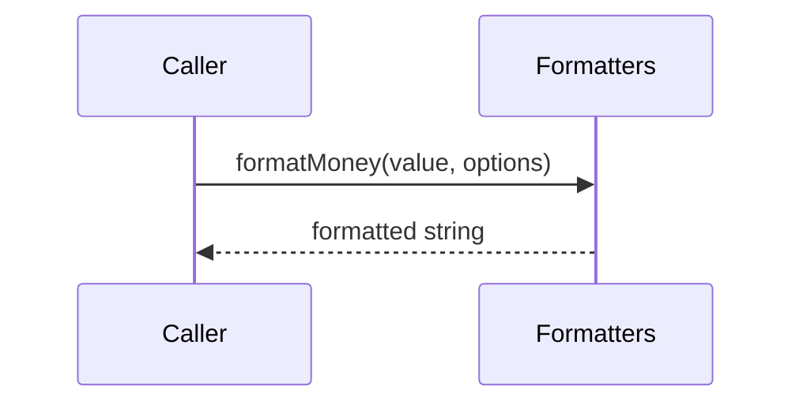

# Formatters

## Overview

Provides formatting helpers for tax IDs, monetary values, and CNAB date/decimal representations.

## Responsibilities

- Format CPF/CNPJ strings with Brazilian masks.
- Format currency values for display.
- Format CNAB date and decimal fields.

## Inputs and outputs

- Inputs:
  - Strings representing tax IDs.
  - Numeric values and formatting options.
  - `Date` instances.
- Outputs:
  - Formatted strings for display or CNAB fields.

## API / Signature

```ts
export interface FormatMoneyOptions {
  showSymbol?: boolean;
  decimalPlaces?: number;
}

export function formatTaxId(taxId: string): string;
export function formatMoney(value: number, options?: FormatMoneyOptions): string;
export function formatDateShort(date: Date): string;
export function formatDateLong(date: Date): string;
export function formatDecimal(value: number, length: number, decimalPlaces?: number): string;
```

## Main flow



## Error handling and edge cases

- Throws when `formatTaxId()` receives invalid length or non-numeric input.

## Examples

```ts
import { formatMoney, formatTaxId } from '@utils/formatters';

const price = formatMoney(1500.5);
const cpf = formatTaxId('12345678901');
```

## Dependencies and integrations

- No external dependencies.
