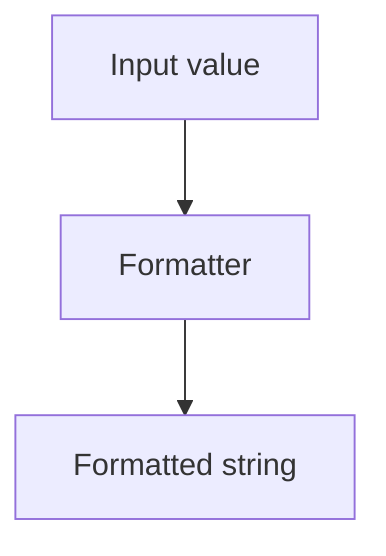

# utils/formatters/index.ts

## Overview

Formatting helpers for tax IDs, currency, dates, and CNAB decimal fields.

## Responsibilities

- Format CPF/CNPJ strings
- Format currency amounts for BRL
- Format dates for CNAB240/400
- Format decimal values with implied decimals

## Inputs and outputs

- Inputs: strings, numbers, and Date values
- Outputs: formatted strings

## API / Signature

```ts
export function formatTaxId(taxId: string): string
export function formatMoney(value: number, options?: FormatMoneyOptions): string
export function formatDateShort(date: Date): string
export function formatDateLong(date: Date): string
export function formatDecimal(value: number, length: number, decimalPlaces?: number): string
```

## Main flow



## Error handling and edge cases

- Throws on invalid tax ID formats or lengths
- Handles negative amounts and zero values

## Examples

```ts
formatTaxId('12345678901'); // "123.456.789-01"
formatMoney(1500.5); // "R$ 1.500,50"
formatDateLong(new Date('2026-01-15')); // "15012026"
```

## Dependencies and integrations

- Used by generators and parsers for CNAB field formatting
