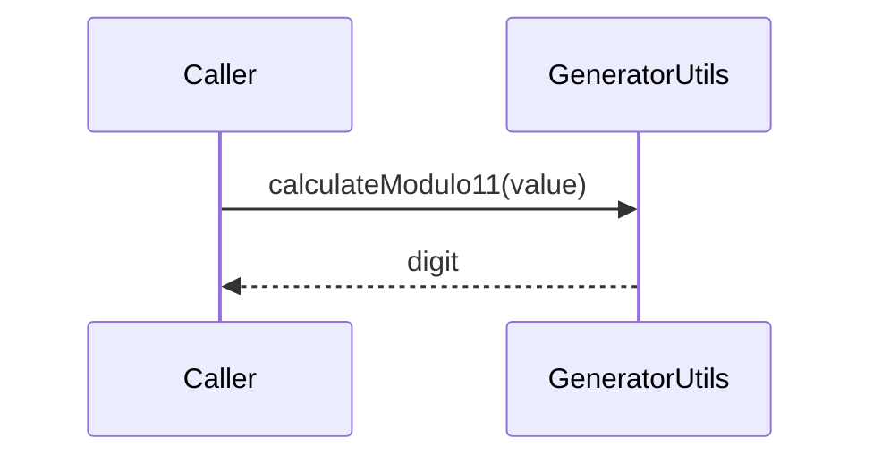

# GeneratorUtils

## Overview

Utility functions for padding and check digit calculations used across CNAB and boleto features.

## Responsibilities

- Provide left/right padding helpers.
- Implement modulo 10 and modulo 11 check digit calculations.

## Inputs and outputs

- Inputs:
  - Strings or numbers for padding.
  - Numeric strings for check digit calculations.
- Outputs:
  - Padded strings.
  - Calculated check digits.

## API / Signature

```ts
export interface Modulo11Options {
  maxWeight?: number;
  replace10?: number;
  replace11?: number;
}

export function padLeft(value: string | number, length: number, fillChar?: string): string;
export function padRight(value: string | number, length: number, fillChar?: string): string;
export function calculateModulo10(value: string): number;
export function calculateModulo11(value: string, options?: Modulo11Options): number;
```

## Main flow



## Error handling and edge cases

- Returns `0` when `calculateModulo11()` receives an empty value.
- `padLeft()` and `padRight()` return an empty string for non-positive lengths.

## Examples

```ts
import { padLeft, calculateModulo10 } from '@utils/generators';

const padded = padLeft('42', 5);
const digit = calculateModulo10('123456');
```

## Dependencies and integrations

- No external dependencies.
