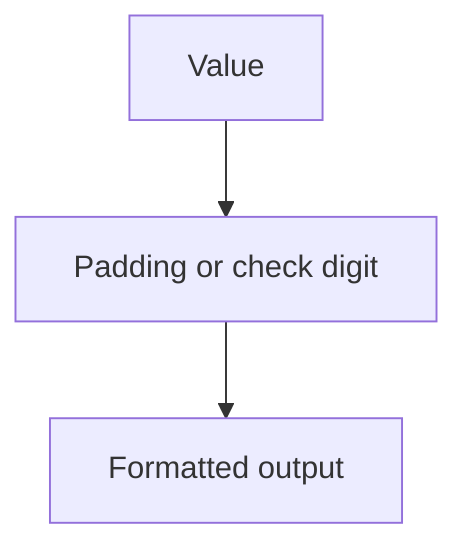

# utils/generators/index.ts

## Overview

Generator helpers for padding and check digit calculations used in CNAB and barcode contexts.

## Responsibilities

- Pad values left/right to fixed lengths
- Calculate modulo 10 and modulo 11 check digits

## Inputs and outputs

- Inputs: strings, numbers, and options
- Outputs: padded strings or numeric check digits

## API / Signature

```ts
export function padLeft(value: string | number, length: number, fillChar?: string): string
export function padRight(value: string | number, length: number, fillChar?: string): string
export function calculateModulo10(value: string): number
export function calculateModulo11(value: string, options?: Modulo11Options): number
```

## Main flow



## Error handling and edge cases

- Returns empty string for non-positive pad lengths
- Handles empty strings in modulo 11 as zero

## Examples

```ts
padLeft('341', 5, '0'); // "00341"
calculateModulo10('123456'); // 4
```

## Dependencies and integrations

- Used by generators and validators
