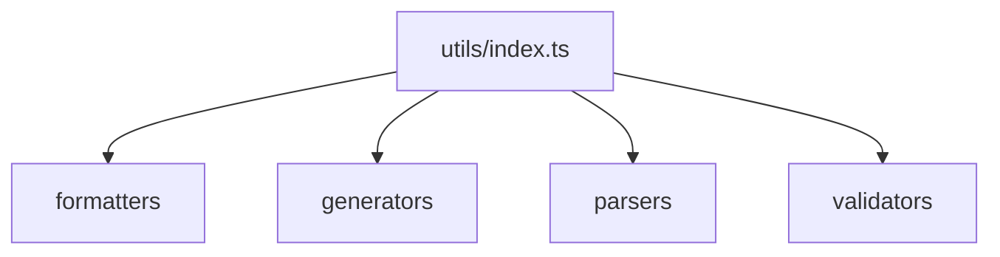

# utils/index.ts

## Overview

Exports the utility modules (formatters, generators, parsers, validators, email) used across the SDK.

## Responsibilities

- Provide a single entry point for utility helpers
- Re-export submodules for public access
- Includes email utilities: `EmailValidator`, `AttachmentHelper`, `EmailTemplateGenerator`

## Inputs and outputs

- Input: N/A
- Output: Named exports from utility modules

## API / Signature

```ts
export * from './formatters';
export * from './generators';
export * from './parsers';
export * from './validators';
```

## Main flow



## Error handling and edge cases

- No runtime logic

## Examples

```ts
import { formatMoney, parseDate, validateTaxId } from '@linkiez/boleto-sdk';
```

## Dependencies and integrations

- `src/utils/formatters`
- `src/utils/generators`
- `src/utils/parsers`
- `src/utils/validators`
