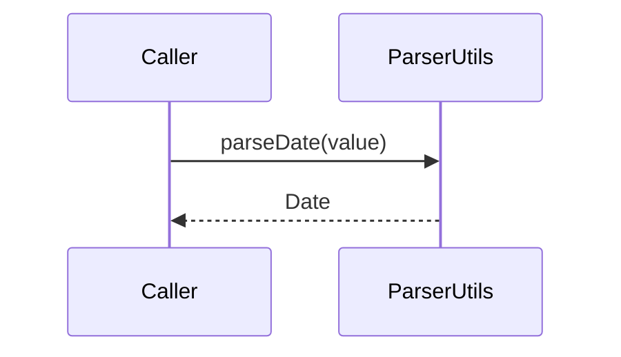

# ParserUtils

## Overview

Parsing helpers for numeric values and CNAB date formats.

## Responsibilities

- Parse numeric strings and implied-decimal values.
- Parse CNAB date formats (short, long, and day-count based).

## Inputs and outputs

- Inputs:
  - Numeric strings and date strings.
  - Decimal precision and CNAB day counts.
- Outputs:
  - Parsed numbers and `Date` instances.

## API / Signature

```ts
export function parseNumber(value: string): number;
export function parseDecimal(value: string, decimalPlaces: number): number;
export function parseDate(value: string): Date;
export function parseDateShort(value: string): Date;
export function parseDateCnab(value: number | string): Date;
```

## Main flow



## Error handling and edge cases

- Throws for invalid numeric or date formats.
- `parseDateCnab()` clamps negative day counts to zero.

## Examples

```ts
import { parseDecimal, parseDateShort } from '@utils/parsers';

const amount = parseDecimal('12345', 2);
const date = parseDateShort('010126');
```

## Dependencies and integrations

- No external dependencies.
