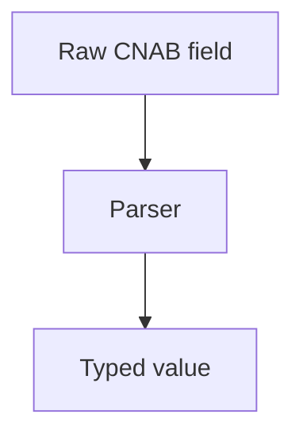

# utils/parsers/index.ts

## Overview

Parsing helpers for numeric, decimal, and CNAB date formats.

## Responsibilities

- Parse numeric strings into integers
- Parse implied-decimal values
- Parse CNAB date formats (DDMMYYYY, DDMMYY, CNAB epoch days)

## Inputs and outputs

- Inputs: strings or numbers
- Outputs: numbers or Date objects

## API / Signature

```ts
export function parseNumber(value: string): number
export function parseDecimal(value: string, decimalPlaces: number): number
export function parseDate(value: string): Date
export function parseDateShort(value: string): Date
export function parseDateCnab(value: number | string): Date
```

## Main flow



## Error handling and edge cases

- Throws on invalid numeric or date formats
- Handles empty values as zero

## Examples

```ts
parseNumber('00123'); // 123
parseDecimal('12345', 2); // 123.45
parseDateShort('150126'); // Date(2026-01-15)
```

## Dependencies and integrations

- Used by parsers to decode CNAB fields
