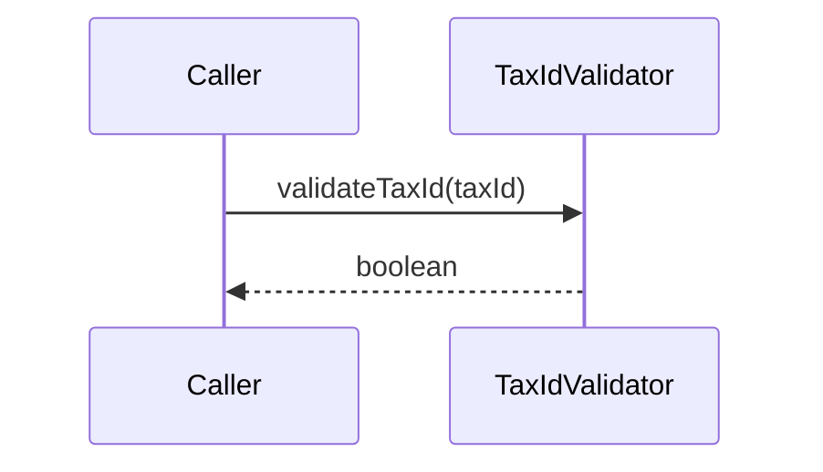

# TaxIdValidator

## Overview

Validates CPF and CNPJ documents using modulo 11 checksum logic.

## Responsibilities

- Normalize input and detect tax ID type.
- Validate CPF and CNPJ checksum digits.

## Inputs and outputs

- Inputs:
  - Tax ID string (formatted or unformatted).
- Outputs:
  - `boolean` indicating validity.

## API / Signature

```ts
export function validateTaxId(taxId: string): boolean;
```

## Main flow



## Error handling and edge cases

- Returns `false` for invalid lengths, non-digit input, or repeated digits.

## Examples

```ts
import { validateTaxId } from '@utils/validators';

const isValid = validateTaxId('111.444.777-35');
```

## Dependencies and integrations

- No external dependencies.
