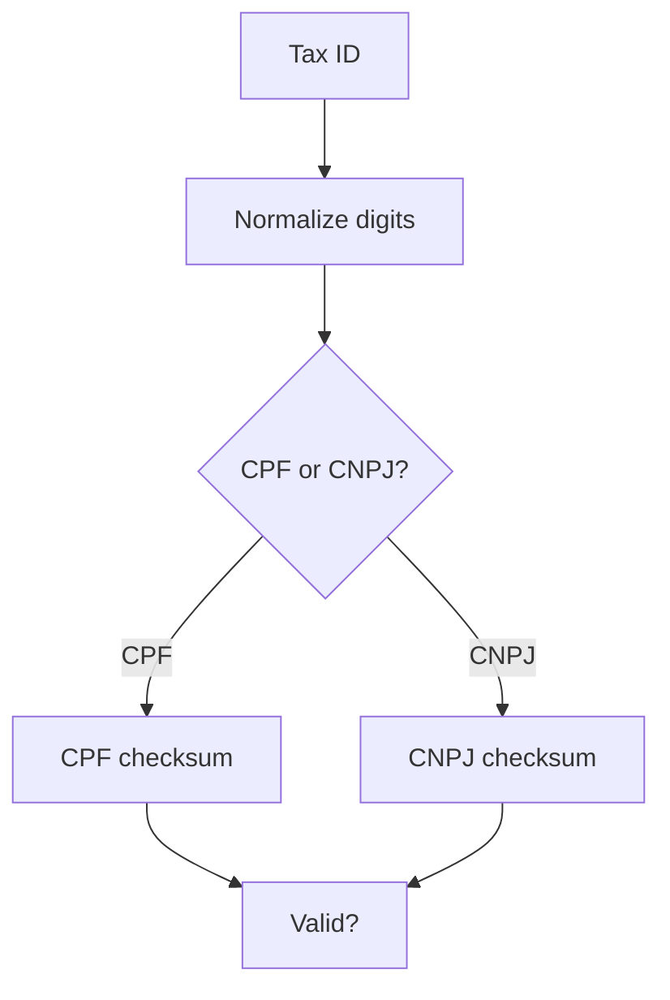

# utils/validators/index.ts

## Overview

Validator helpers for Brazilian tax IDs (CPF/CNPJ).

## Responsibilities

- Validate CPF and CNPJ using modulo 11
- Reject invalid lengths or repeated digits

## Inputs and outputs

- Input: CPF/CNPJ string (formatted or unformatted)
- Output: boolean validity

## API / Signature

```ts
export function validateTaxId(taxId: string): boolean
```

## Main flow



## Error handling and edge cases

- Returns false for invalid or empty inputs
- Rejects repeated-digit CPF/CNPJ

## Examples

```ts
validateTaxId('111.444.777-35'); // true
validateTaxId('11111111111'); // false
```

## Dependencies and integrations

- Used by schemas and validators
