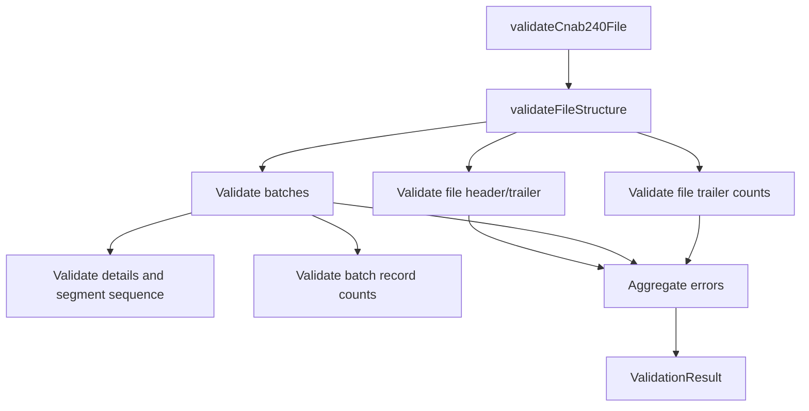

# Cnab240Validator

## Overview

Provides structural validation for CNAB240 files, including batch integrity, segment sequence, and record count consistency.

## Responsibilities

- Validate file header and trailer presence.
- Validate batches, including header/trailer consistency.
- Validate segment sequence (P, Q, optional R).
- Validate record counts at batch and file level.
- Validate file shape with Zod schema.

## Inputs and outputs

- Inputs:
  - `Cnab240File`
- Outputs:
  - `ValidationResult` with `isValid` and `errors`.

## Main flow



## Error handling and edge cases

- Missing `fileHeader` or `fileTrailer`.
- Empty `batches` collection.
- Missing batch header or trailer.
- Invalid segment codes or record types.
- Invalid segment sequence (non-consecutive sequential numbers).
- Mismatched batch or file record counts.
- Zod schema validation errors are reported with field paths.

## Examples

```ts
import { validateCnab240File } from '@/validators/cnab240';

const result = validateCnab240File(file);
if (!result.isValid) {
  console.error(result.errors);
}
```

## Dependencies and integrations

- Uses `RECORD_TYPE` from constants.
- Uses `ValidationResult` from common validators.
- Operates on `Cnab240File`, `Batch`, and `DetailRecord` types.
