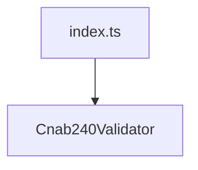

# CNAB240 Validators Barrel

## Overview

Exports CNAB240 validation functions.

## Responsibilities

- Provide a single entry point for CNAB240 validators.

## Inputs and outputs

- Inputs: none.
- Outputs: re-exports of CNAB240 validator functions.

## Main flow



## Error handling and edge cases

- No runtime behavior; exports only.

## Examples

```ts
import { validateCnab240File } from '@/validators/cnab240';
```

## Dependencies and integrations

- Re-exports from Cnab240Validator.
