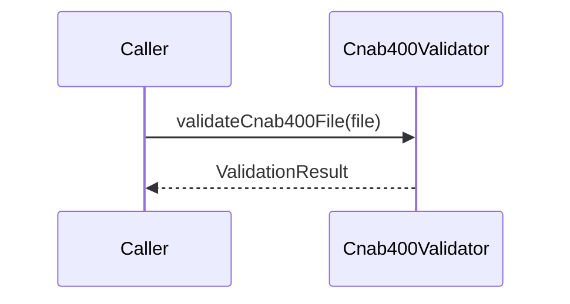

# Cnab400Validator

## Overview

Validates CNAB400 file structure and schema compliance.

## Responsibilities

- Validate structural integrity (header, trailer, details, record counts).
- Validate Zod schemas for remittance and return formats.

## Inputs and outputs

- Inputs:
  - `Cnab400File` instances.
- Outputs:
  - `ValidationResult` with `isValid` and error messages.

## API / Signature

```ts
export function validateFileStructure(file: Cnab400File): ValidationResult;
export function validateCnab400File(file: Cnab400File): ValidationResult;
```

## Main flow



## Error handling and edge cases

- Aggregates schema errors and structural errors into a single list.

## Examples

```ts
import { validateCnab400File } from '@validators/cnab400';

const result = validateCnab400File(file);
```

## Dependencies and integrations

- Depends on CNAB400 schemas in [src/schemas/cnab400](../../schemas/cnab400/index.ts).
