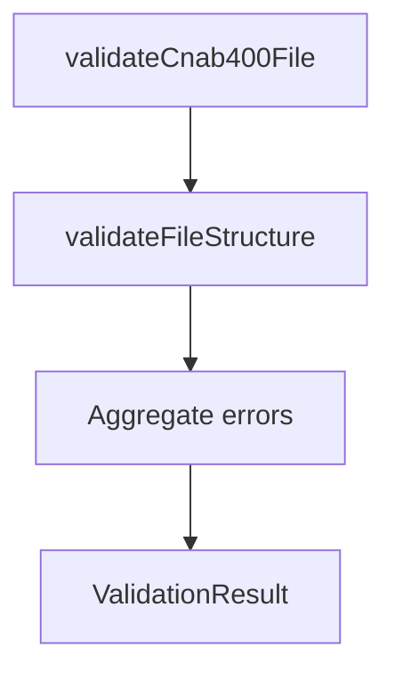

# CNAB400 Validators

## Overview

Provides structural validation for CNAB400 files.

## Responsibilities

- Validate header, trailer, and detail presence.
- Validate record count consistency.
- Provide a consistent validation result.
- Validate file shape with Zod schema (CNAB400 and return).

## Inputs and outputs

- Inputs:
  - `Cnab400File`
- Outputs:
  - `ValidationResult` with `isValid` and `errors`.

## Main flow



## Error handling and edge cases

- Missing header, trailer, or details.
- Record count mismatch between expected and trailer total.
- Schema validation errors include field paths when schema parsing fails.

## Examples

```ts
import { validateCnab400File } from '@/validators/cnab400';

const result = validateCnab400File(file);
if (!result.isValid) {
  console.error(result.errors);
}
```

## Dependencies and integrations

- Uses `ValidationResult` from common validators.
