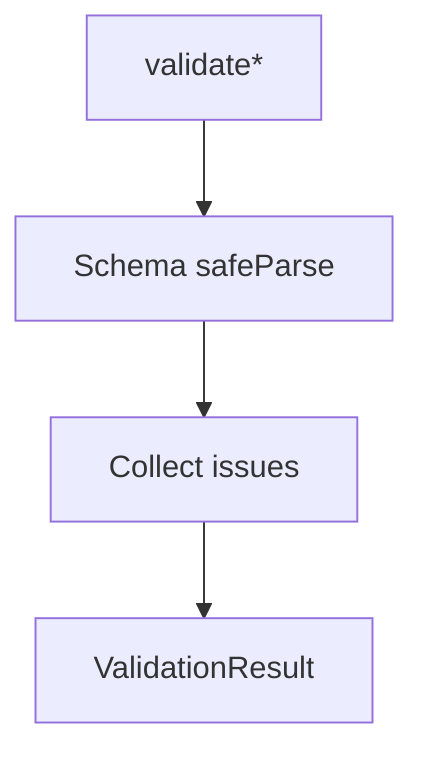

# CommonValidators

## Overview

Validation helpers that apply shared Zod schemas to common domain structures.

## Responsibilities

- Validate address, tax ID, bank account, beneficiary, and payer data.
- Standardize schema error output as `ValidationResult`.

## Inputs and outputs

- Inputs:
  - Address-like objects
  - Tax ID objects (`{ type, number }`)
  - Bank account objects
  - Beneficiary and payer objects
- Outputs:
  - `ValidationResult` with `isValid` and `errors`.

## Main flow



## Error handling and edge cases

- Returns `isValid: false` with path-aware error messages.
- Aggregates all schema issues.

## Examples

```ts
import { validatePayer } from '@/validators/common';

const result = validatePayer({
  name: 'John Doe',
  taxId: { type: 'CPF', number: '11144477735' },
  address: {
    street: 'Rua das Flores',
    district: 'Centro',
    city: 'Sao Paulo',
    state: 'SP',
    postalCode: '01234567',
  },
});

if (!result.isValid) {
  console.error(result.errors);
}
```

## Dependencies and integrations

- Uses shared schemas from `src/schemas/common`.
- Returns `ValidationResult` for consistency.
