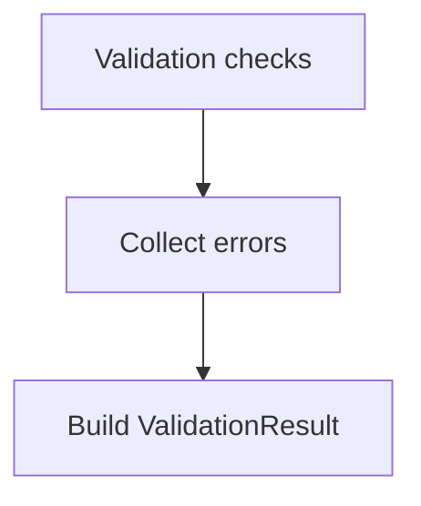

# ValidationResult

## Overview

Standard result object for validation operations across the SDK.

## Responsibilities

- Provide a consistent validation response shape.
- Aggregate human-readable validation errors.

## Inputs and outputs

- Inputs:
  - Validation logic populates `errors` based on checks.
- Outputs:
  - `ValidationResult` with `isValid` and `errors`.

## Main flow



## Error handling and edge cases

- `errors` must be an empty array when `isValid` is `true`.
- `errors` may include multiple messages to support aggregated validation.

## Examples

```ts
import type { ValidationResult } from '@/validators/common';

const result: ValidationResult = {
  isValid: false,
  errors: ['Missing file header'],
};
```

## Dependencies and integrations

- Used by CNAB240 and CNAB400 validators.
