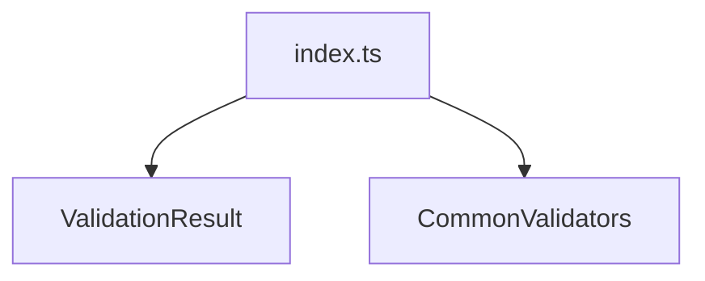

# Common Validators Barrel

## Overview

Barrel file that exposes shared validator types and utilities.

## Responsibilities

- Export shared validation types (e.g., `ValidationResult`).
- Export common validator helpers.

## Inputs and outputs

- Inputs: none.
- Outputs: re-exports of common validator utilities.

## Main flow



## Error handling and edge cases

- No runtime behavior; exports only.

## Examples

```ts
import type { ValidationResult } from '@/validators/common';
import { validatePayer } from '@/validators/common';
```

## Dependencies and integrations

- Centralized export for validator modules.
