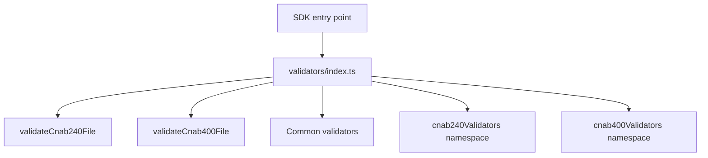

# validators/index

## Overview

Provides curated validator exports for the SDK entry point, avoiding name collisions while keeping the public API stable.

## Responsibilities

- Expose primary validator functions (`validateCnab240File`, `validateCnab400File`).
- Expose common validators that are safe to re-export at the package root.
- Offer namespace exports for CNAB240/CNAB400 validators to avoid ambiguous names.

## Inputs and outputs

- Inputs: CNAB file objects or common data structures used by validators.
- Outputs: `ValidationResult` objects describing validity and error details.

## API / Signature

```ts
export { validateCnab240File } from './cnab240';
export { validateCnab400File } from './cnab400';
export { validateAddress, validateBankAccount, validateBeneficiary, validatePayer } from './common';
export type { ValidationResult } from './common';
export * as cnab240Validators from './cnab240';
export * as cnab400Validators from './cnab400';
```

## Main flow



## Error handling and edge cases

- Name collisions are avoided by limiting direct exports and using namespaces.
- Common validators that overlap with utilities are not re-exported at the package root.

## Examples

```ts
import { validateCnab240File, validateCnab400File } from '@linkiez/boleto-sdk';

const cnab240Result = validateCnab240File(cnab240Data);
const cnab400Result = validateCnab400File(cnab400Data);
```

```ts
import { validators } from '@linkiez/boleto-sdk';

const result = validators.cnab240Validators.validateFileStructure(cnab240Data);
```

## Dependencies and integrations

- Depends on CNAB-specific validator modules and `ValidationResult` from `src/validators/common`.
- Consumed by the SDK root export in `src/index.ts`.
