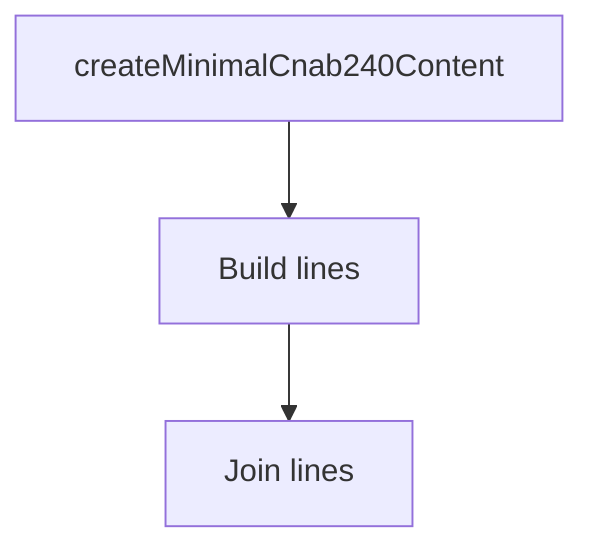

# cnab240-content

## Overview

Helper for building minimal CNAB240 file content strings for integration tests.

## Responsibilities

- Provide a valid minimal CNAB240 content string.
- Allow field overrides via `updateLineField`.

## Inputs and outputs

- Inputs:
  - `createMinimalCnab240Content(): string`
  - `updateLineField(line, value, start, end): string`
- Outputs:
  - CNAB240 content string or updated line string.

## Main flow



## Error handling and edge cases

- Caller must provide valid positions for updates.

## Examples

```ts
import { createMinimalCnab240Content, updateLineField } from '../helpers/cnab240-content';

const content = createMinimalCnab240Content();
const lines = content.split('\n');
lines[0] = updateLineField(lines[0], '1', 8, 8);
```

## Dependencies and integrations

- Used by CNAB240 integration tests.
