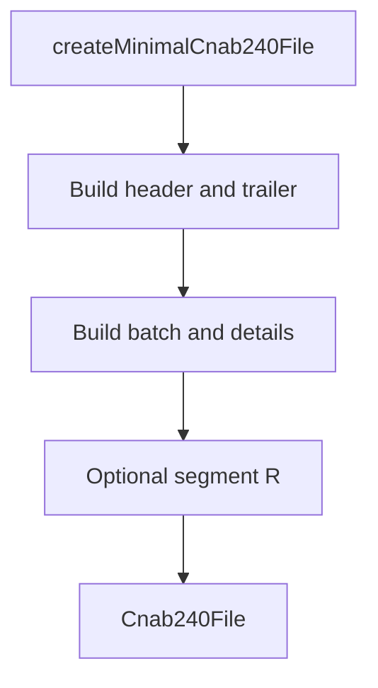

# cnab240

## Overview

Test helper that provides a minimal CNAB240 file structure for integration and unit tests.

## Responsibilities

- Build a valid `Cnab240File` object with segments P and Q.
- Optionally include segment R for extended scenarios.

## Inputs and outputs

- Inputs:
  - `includeSegmentR: boolean` (default: `true`)
- Outputs:
  - `Cnab240File` object

## Main flow



## Error handling and edge cases

- Uses consistent counts for batch and file totals based on `includeSegmentR`.

## Examples

```ts
import { createMinimalCnab240File } from '../helpers/cnab240';

const file = createMinimalCnab240File();
```

## Dependencies and integrations

- Uses CNAB240 types from `src/types`.
