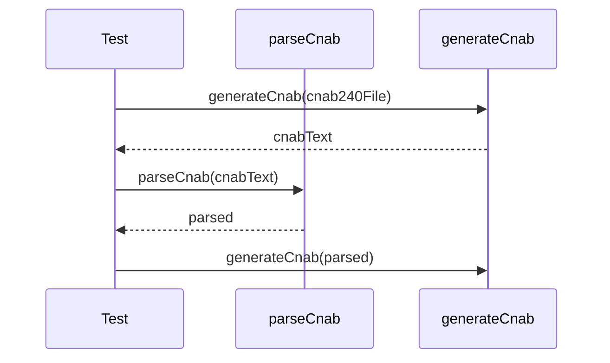

# cnab-cross-format.test.ts

## Overview

Integration tests validating cross-format parsing and generation across CNAB240 and CNAB400, including a large-file scenario for CNAB240.

## Responsibilities

- Validate factory parsing and generation for CNAB240
- Validate parsing and regeneration of CNAB400 fixtures
- Validate generation and parsing of large CNAB240 files

## Inputs and outputs

- Inputs: CNAB240 in-memory structures, CNAB400 fixture files
- Outputs: Generated CNAB content and parsed structures validated by assertions

## API / Signature

```ts
// tests/integration/cnab-cross-format.test.ts
```

## Main flow



## Error handling and edge cases

- Ensures line lengths are fixed (240/400)
- Verifies large CNAB240 structures produce expected record counts

## Examples

- Generate a CNAB240 file with multiple batches and verify record counts
- Parse CNAB400 fixture and ensure output lines are 400 characters

## Dependencies and integrations

- Uses factory functions: `parseCnab`, `generateCnab`
- Reads CNAB400 fixtures from tests/fixtures/cnab400
- Uses helper `createMinimalCnab240File` from tests/helpers/cnab240
