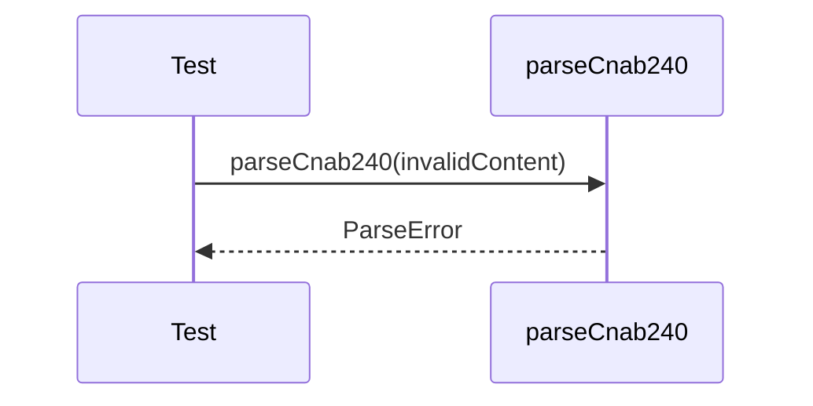

# cnab240-error-handling.test.ts

## Overview

Integration tests for CNAB240 parser error handling using malformed inputs.

## Responsibilities

- Reject files with too few lines
- Reject invalid line lengths
- Reject invalid header record types

## Inputs and outputs

- Inputs: malformed CNAB240 text
- Outputs: thrown `ParseError`

## API / Signature

```ts
// tests/integration/cnab240-error-handling.test.ts
```

## Main flow



## Error handling and edge cases

- Line count below minimum
- Line length different from 240
- Invalid file header record type

## Examples

- Validate that malformed input throws `ParseError`

## Dependencies and integrations

- `parseCnab240` from src/parsers/cnab240
- `ParseError` from src/errors
- `createMinimalCnab240Content` from tests/helpers/cnab240-content
