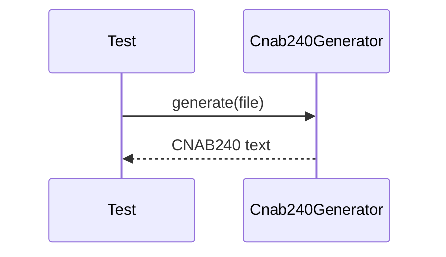

# cnab240-generator.test.ts

## Overview

Integration tests for CNAB240 generation with fixed-length output validation.

## Responsibilities

- Generate CNAB240 content from a minimal structure
- Verify line lengths and record type positions
- Verify required segments are present

## Inputs and outputs

- Inputs: `Cnab240File` from `createMinimalCnab240File`
- Outputs: CNAB240 text with 240-character lines

## API / Signature

```ts
// tests/integration/cnab240-generator.test.ts
```

## Main flow



## Error handling and edge cases

- Ensures record types appear in expected positions
- Ensures optional Segment R is emitted when present

## Examples

- Validate that header and trailer record types are present
- Validate segment codes P, Q, and R

## Dependencies and integrations

- `Cnab240Generator` from src/generators/cnab240
- `createMinimalCnab240File` from tests/helpers/cnab240
