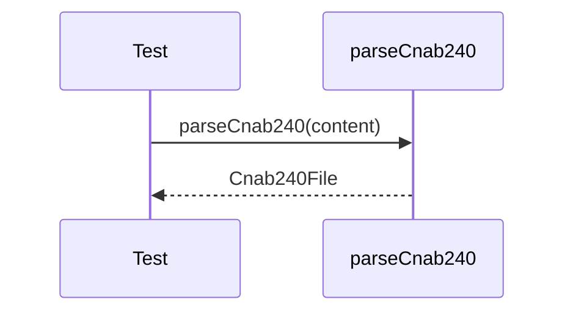

# cnab240-parser.test.ts

## Overview

Integration tests for CNAB240 parsing using a minimal valid fixture produced by helpers.

## Responsibilities

- Parse a minimal CNAB240 file
- Validate header, batch, detail, and trailer fields
- Ensure hierarchical structure is preserved

## Inputs and outputs

- Inputs: CNAB240 text from `createMinimalCnab240Content`
- Outputs: Parsed `Cnab240File` structure validated by assertions

## API / Signature

```ts
// tests/integration/cnab240-parser.test.ts
```

## Main flow



## Error handling and edge cases

- Ensures required segments P and Q exist
- Validates header and trailer fields

## Examples

- Parse file header and confirm `bankCode` and `recordType`
- Parse Segment P and Segment Q fields

## Dependencies and integrations

- `parseCnab240` from src/parsers/cnab240
- `createMinimalCnab240Content` from tests/helpers/cnab240-content
