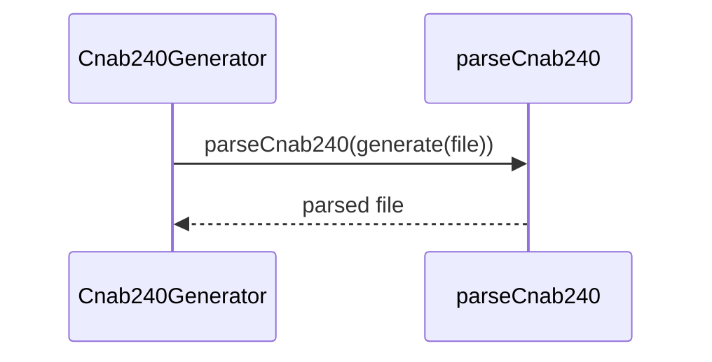

# cnab240-round-trip.test.ts

## Overview

Integration test for CNAB240 round-trip consistency (generate → parse).

## Responsibilities

- Generate CNAB240 content
- Parse generated content
- Verify key fields are preserved

## Inputs and outputs

- Inputs: `Cnab240File` structure
- Outputs: Parsed `Cnab240File` validated against source data

## API / Signature

```ts
// tests/integration/cnab240-round-trip.test.ts
```

## Main flow



## Error handling and edge cases

- Ensures optional Segment R data survives the round-trip

## Examples

- Compare document number and payer name
- Verify Segment R discount/fine fields

## Dependencies and integrations

- `Cnab240Generator` from src/generators/cnab240
- `parseCnab240` from src/parsers/cnab240
