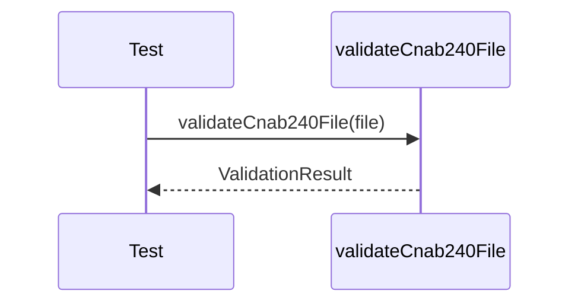

# cnab240-validation.test.ts

## Overview

Integration tests for CNAB240 validation rules and error reporting.

## Responsibilities

- Validate a correct CNAB240 structure
- Assert errors for structural mismatches
- Assert errors for missing required segments

## Inputs and outputs

- Inputs: `Cnab240File` objects
- Outputs: `ValidationResult` with `isValid` and `errors`

## API / Signature

```ts
// tests/integration/cnab240-validation.test.ts
```

## Main flow



## Error handling and edge cases

- File trailer record count mismatch
- Missing Segment Q in detail

## Examples

- Confirm `isValid` and error messages

## Dependencies and integrations

- `validateCnab240File` from src/validators/cnab240
- `createMinimalCnab240File` from tests/helpers/cnab240
