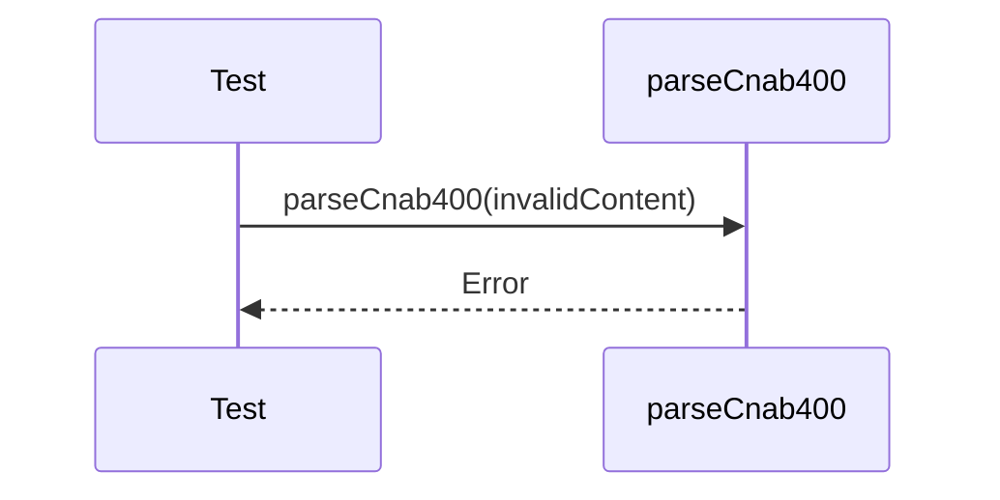

# cnab400-error-handling.test.ts

## Overview

Integration tests for CNAB400 parser error scenarios.

## Responsibilities

- Validate parser errors for malformed input
- Verify error messages and types

## Inputs and outputs

- Inputs: invalid CNAB400 content
- Outputs: thrown parser errors

## API / Signature

```ts
// tests/integration/cnab400-error-handling.test.ts
```

## Main flow



## Error handling and edge cases

- Invalid line lengths
- Invalid record types
- Missing trailer

## Examples

- Assert `parseCnab400` throws on malformed input

## Dependencies and integrations

- `parseCnab400` from src/parsers/cnab400
