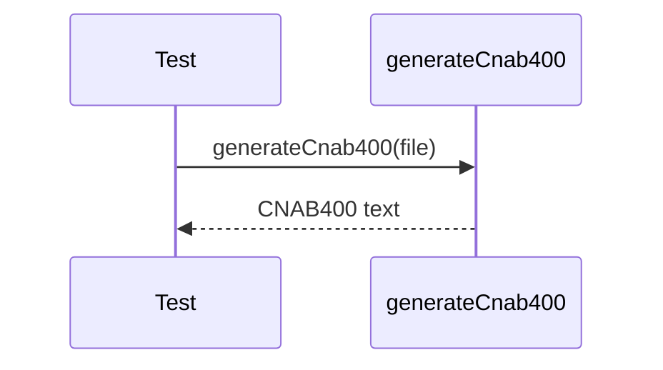

# cnab400-generator.test.ts

## Overview

Integration tests for CNAB400 generator output validation.

## Responsibilities

- Generate CNAB400 content from structured data
- Validate 400-character line length
- Validate record types and field placement

## Inputs and outputs

- Inputs: `Cnab400File` structure
- Outputs: CNAB400 text with fixed-length lines

## API / Signature

```ts
// tests/integration/cnab400-generator.test.ts
```

## Main flow



## Error handling and edge cases

- Ensures all lines match 400 characters
- Ensures trailer and detail counts are consistent

## Examples

- Generate CNAB400 from parsed structure and verify record types

## Dependencies and integrations

- `generateCnab400` from src/generators/cnab400
- `parseCnab400` for round-trip validation
