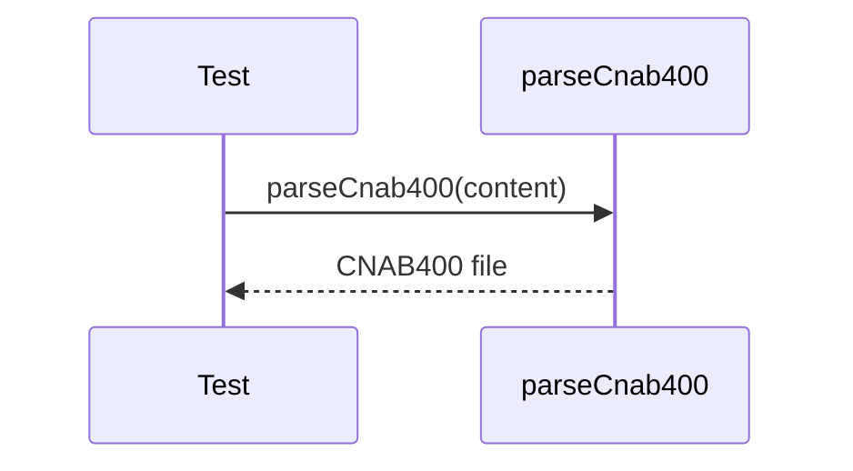

# cnab400-parser.test.ts

## Overview

Integration tests for CNAB400 parser using real fixture files.

## Responsibilities

- Ensure lines are 400 characters
- Parse header, details, and trailer
- Validate bank code and key fields

## Inputs and outputs

- Inputs: CNAB400 fixture content from `tests/fixtures/cnab400`
- Outputs: Parsed `Cnab400File` or `Cnab400ReturnFile`

## API / Signature

```ts
// tests/integration/cnab400-parser.test.ts
```

## Main flow



## Error handling and edge cases

- Validates header and trailer record types
- Validates presence of detail records

## Examples

- Parse Itaú return fixture and check header/trailer fields

## Dependencies and integrations

- `parseCnab400` from src/parsers/cnab400
- CNAB400 fixture files in tests/fixtures/cnab400
