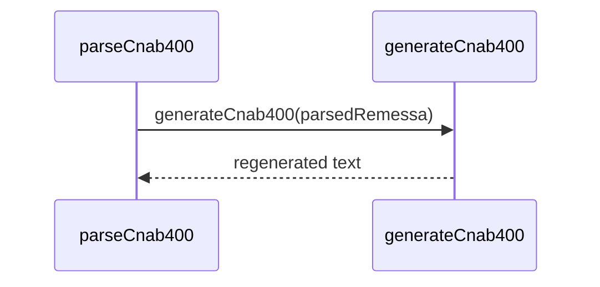

# cnab400-remessa.test.ts

## Overview

Integration tests for CNAB400 REMESSA parsing and generation using fixture files.

## Responsibilities

- Parse REMESSA fixtures
- Validate header and detail fields
- Generate CNAB400 output and re-parse

## Inputs and outputs

- Inputs: REMESSA fixture files
- Outputs: parsed structures and generated CNAB400 text

## API / Signature

```ts
// tests/integration/cnab400-remessa.test.ts
```

## Main flow



## Error handling and edge cases

- Ensures 400-character line length
- Ensures detail records and trailer are present

## Examples

- Parse Itaú remessa fixture and validate header fields

## Dependencies and integrations

- `parseCnab400` from src/parsers/cnab400
- `generateCnab400` from src/generators/cnab400
- CNAB400 remessa fixtures in tests/fixtures/cnab400
